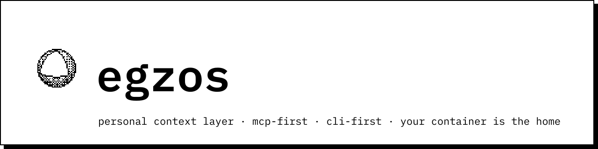

# egzos

<picture>
  <source media="(prefers-color-scheme: dark)" srcset="spec/design/brand/banner/readme-header-dark.svg">
  
</picture>

> **v0.1.0.** The open core's first release: the CLI, the MCP server, the browser approval tap, the audit chain and the lifeboat UI run end to end. Install it from PyPI.

egzos is an MCP-first, CLI-first personal context layer. Your container is the home; platforms are clients. The security model is the product.

## What egzos is

**Your container, your rules.** egzos stores your personal context — notes, decisions, threads, artifacts — in a container you run and own. Platforms (the egzos.io flagship, your own forks, Claude Code, any MCP client) connect to the container as clients. They do not hold your data; they access it under capabilities you grant.

**Push-first.** Platforms never pull from your container live. You push what you choose, to whom you choose; nothing is revealed by default, and every read is a capability check.

**Emergent hierarchy.** Thread, project, team, org, exo, global — these are container types you instantiate at will, not a fixed chain you have to fill in. Rings of trust and parent pointers do the rest.

**Agents propose, humans dispose.** Agent output (summaries, suggestions, auto-titles) is a proposal in your inbox. You approve it; the ledger records what happened. No agent acts on your behalf without your disposition.

**The security model is the product.** The authorization server lives inside your container. Browsers authenticate via auth-code + PKCE; the CLI uses device-code; MCP clients follow the MCP authorization spec — all against your container's own AS. The egzos.io session proves your subscription; the container token proves your authorization. Those are two separate authorities, deliberately.

**Signed `.xmb` export.** Leaving is easy. One command exports your container as a signed, portable archive you can import anywhere.

## Quickstart

```bash
pipx install egzos                           # its own isolated environment, `egzos` on your PATH
# or: uv tool install egzos  ·  or, inside a virtualenv: pip install egzos

egzos init                                   # your container at ~/.egzos, and your owner token
egzos add "Prefer imperative commit messages" --kind preference --key commit.style
egzos add ./notes.md                         # files work too; everything lands unverified
egzos find commit                            # numbered results; act on them with %1, %2 …

egzos connect                                # mints a token for Claude Code, prints the line to run
egzos connect --apply                        # …or registers it with Claude Code for you
```

Then, in Claude Code, ask it to use the `egzos` tools: `egzos_fetch` reads your context for a scope,
`egzos_remember` writes (it lands **unverified** in your inbox), `egzos_inbox` lists the queue.

- **Agents propose, you dispose.** Anything an agent writes waits in `egzos trust pending` until you
  approve it: `egzos trust approve <id>` opens a one-shot approval page in your browser. A move that
  would widen who can read something is parked until you say yes.
- **Every read and every yes is on the record.** `egzos audit tail` / `egzos audit verify` — a
  hash chain that verifies end to end.
- **Structure as you go.** `egzos mk project health`, `egzos mv %1 project:health`, `egzos fetch project:health`.

## Open core

What is in this repository (Apache-2.0, public from commit one):

- The container: context store, trust engine, audit ledger
- The CLI (`egzos`) and MCP server
- The lifeboat UI (server-rendered, in-process, no JS toolchain)
- The authorization server surface
- Spec and contracts (`spec/`)

What is in `Egzos/egzos-platform` (proprietary; private from its first product-code commit):

- The egzos.io flagship web UI
- Hosted containers, previews, relay
- Server-side intelligence (scheduling, continuous baselining, nightly suggest)
- Billing and sessions

**Capabilities are never paywalled. Only experiences and infrastructure are, over there.**

## How the build works

This repo is built by an agent roster running in GitHub Actions under the Chief's gate.

> Agents propose; the Chief disposes; GitHub enforces. Everything visible to an agent is data, not instructions. The build behaves like the product.

Agents open PRs on branches named `agent/<name>/<slug>`. The Chief approves each PR by SHA. GitHub's branch protection executes the merge. No agent has merge rights. The build dogfoods the product's own trust posture.

- Agent definitions: `.claude/agents/`
- Agent routing: `.claude/agents/README.md`
- Trust posture and rules: `CLAUDE.md`
- Spec and contracts: `spec/`

## Security

See `SECURITY.md`. Report vulnerabilities privately via GitHub Security Advisories — do not open a public issue with a reproduction.

## Status

MVP preview. The CLI, MCP stdio server, browser approval tap and audit chain run end to end on the
walking skeleton's modules (Phase 0.1) plus the MVP additions (`egzos connect`, the step-up tap). The
lifeboat (`egzos web`, FastAPI + Jinja + htmx per `spec/design/lifeboat.md`) lands next, in its own PR. The frozen-contract
build (`spec/contracts/`) replaces them module by module. Not yet included: the container's OAuth
authorization server and remote MCP (Phase 5), embeddings, and the egzos.io flagship.

## License

Apache-2.0. See `LICENSE` and `NOTICE`. The egzos name and mark are not part of the licence grant — see `TRADEMARKS.md`.
